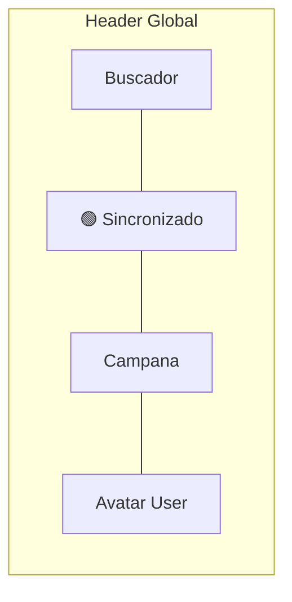

# Reporte de Evaluación UX/UI: Diagnóstico y Propuestas de Mejora

Este reporte presenta una revisión detallada del diseño visual, usabilidad (UX) e interfaz de usuario (UI) del frontend actual en `erp-frontend`.

---

## 🎨 1. Diagnóstico de Módulos de Autenticación (Auth)

### 🔑 Iniciar Sesión (`/login`)
*   **Problema (Falta de control de contraseña):** No existe un botón de "Ojo" (toggle) para alternar la visibilidad de la contraseña (`show/hide`).
    *   *Impacto en UX:* El usuario no puede verificar si cometió un error de tipeo en contraseñas complejas.
*   **Problema (Estética básica de fondo):** El fondo del layout de autenticación (`AuthLayout`) es un gris plano (`bg-slate-50`). No aprovecha las pautas de diseño premium (como patrones de gradientes o texturas fluidas de fondo).
    *   *Impacto en UI:* Primera impresión visual del software "sencilla" o "básica" en lugar de verse premium.

### 📝 Registro de Cuenta (`/register`)
*   **Problema (Formato de RIF a ciegas):** El RIF se valida estrictamente con formato regex venezolano (Ej: `J-12345678-9`), pero el campo de entrada no cuenta con un texto de ayuda debajo. El usuario solo se entera de la validación si ingresa un RIF incorrecto y se dispara el banner de error del formulario.
    *   *Impacto en UX:* Genera frustración y reduce las conversiones de registro exitoso.
*   **Problema (Falta de confirmación de contraseña):** El formulario de registro solo tiene un campo de contraseña. No incluye un campo de "Confirmar contraseña" ni el botón de alternar visibilidad.

### 📨 Recuperar Contraseña (`/forgot-password`)
*   **Problema (Navegabilidad post-éxito):** En el estado de éxito (tras disparar el enlace de recuperación), el usuario se encuentra con instrucciones específicas sobre buscar en la consola, lo cual es excelente para desarrollo, pero no tiene un botón rápido para volver al login o retroceder de forma sencilla una vez leído.

---

## 🎨 2. Diagnóstico de Layout y Módulo Dashboard

### ❌ Choque de Diseño y Doble Cabecera en el POS
*   **Problema:** La vista del Punto de Venta (`PosInterface.tsx`) incluye su propia barra superior azul (`ARI POS` + indicador de estado offline). Al renderizarse dentro del layout principal del dashboard (que ya tiene un header con barra de búsqueda, perfil y notificaciones), se produce un choque visual con **dos cabeceras superiores consecutivas**.
*   **Impacto en UX:* Confunde al usuario, desaprovecha espacio vertical útil para la búsqueda de productos y rompe la consistencia visual del sistema.

### ❌ Clashing de Scrollbars y Alturas Rígidas (`h-screen`)
*   **Problema:** El componente del POS está maquetado con la clase `h-screen` (100% de la altura de la pantalla). Sin embargo, al renderizarse dentro del contenedor principal `<main className="p-8">` (que ya tiene márgenes y está desplazado por la cabecera de 64px), la pantalla se desborda y crea scrollbars dobles y cruzados.
*   **Impacto en UX:* Interacción frustrante al hacer scroll en el carrito o en la cuadrícula de productos en tablets y laptops de baja resolución.

### ❌ Iniciales de Usuario y Nombres Hardcodeados
*   **Problema:** El panel principal saluda con un estático `"Bienvenido, Harold"` y el avatar del header muestra fijas las iniciales `"HV"`.
*   **Impacto en UX:* Rompe la ilusión de personalización para otros usuarios del tenant (como los cajeros creados en el seed data).

### ❌ Indicador de Resiliencia Local-First Oculto
*   **Problema:** El indicador de conexión (Offline / Sincronizado) solo está visible en la vista del Punto de Venta, pero el soporte offline y las consultas de stock locales impactan a todo el sistema.
*   **Impacto en UX:* Si la conexión a internet falla mientras el usuario está en el Inventario o en Nómina, no sabrá por qué falló la carga o si sus transacciones están protegidas localmente.

---

## 💡 3. Propuestas de Rediseño y Mejora de Experiencia

### 🔐 Propuesta A: Toggles de Contraseña y Ayuda de RIF
*   Añadir el botón con icono de `Eye` / `EyeOff` en los campos de contraseña en login y registro.
*   Añadir una pequeña leyenda de ayuda debajo del RIF: `* Formato requerido: J-12345678-9`.

### 🔄 Propuesta B: Cabecera Única y Globalizada
Reubicar el **Indicador de Resiliencia (Sincronizado / Offline)** directamente en el Header del layout principal del dashboard.
*   **Beneficio:** Liberamos el POS de cabeceras redundantes y permitimos al usuario conocer el estado de la conexión en cualquier pantalla de forma global.

### 📏 Propuesta C: Altura Responsiva Dinámica para el POS
Modificar la estructura del POS para usar contenedores flexibles (`flex flex-col h-[calc(100vh-12rem)]`) que se adapten automáticamente al tamaño del layout del dashboard sin provocar barras de desplazamiento duplicadas.

### 👤 Propuesta D: Dinamizar Datos de Sesión
Reemplazar los textos estáticos en la cabecera y en la bienvenida utilizando el objeto `user` provisto por `useAuth()`:
*   Iniciales: Obtener las iniciales dinámicamente de `user.full_name` (ej. "Juan Pérez" -> "JP").
*   Bienvenida: Renderizar `Bienvenido, {user?.full_name.split(' ')[0]}`.

### ⏳ Propuesta E: Skeletons de Carga
Implementar Skeletons animados (con Tailwind `animate-pulse`) para simular la estructura de los productos en el POS y la tabla de stock de inventario mientras se completan las llamadas a la API.

---

## 📅 Plan de Acción Recomendado

1.  **Paso 1 (Auth):** Añadir toggles de visibilidad en contraseñas y leyendas de ayuda de RIF.
2.  **Paso 2 (Layout Header):** Refactorizar el Header global en `layout.tsx` para incorporar el indicador de estado de red.
3.  **Paso 3 (Layout Dashboard):** Dinamizar los textos y avatares del dashboard con los datos reales del usuario logueado en `AuthContext`.
4.  **Paso 4 (POS):** Rediseñar la maquetación del POS para que se integre fluidamente dentro del contenedor y soporte scroll interno nativo en el grid de productos y el carrito.
