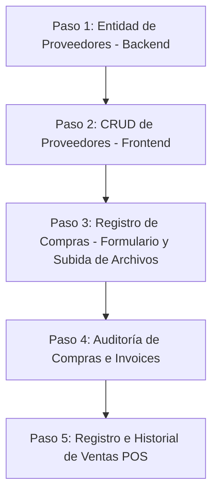

# Propuesta de Nuevos Módulos: Proveedores, Compras y Ventas

De acuerdo con tu visión de negocio y en colaboración con el equipo de análisis (**John `📋`** y **Sally `🎨`**), evaluamos la incorporación de estas tres secciones operativas en el sistema.

---

## 🏢 1. Módulo de Proveedores (Nueva Entidad)

Actualmente, el backend registra el proveedor como un simple texto libre (`supplier_name`) en las facturas de compra. Proponemos crear un módulo formal de **Proveedores** para tener un catálogo estructurado y evitar errores de escritura.

### Especificación de Base de Datos (Backend)
Crearemos la entidad `Provider`:
*   `id`: UUID (Clave primaria).
*   `tenant_id`: UUID (Aislamiento de inquilino).
*   `name`: String (Razón social / Nombre).
*   `tax_id` (RIF): String (Ej. J-12345678-9, único por tenant).
*   `email`, `phone`, `address`: Strings (Datos de contacto).
*   `is_active`: Boolean (Desactivación lógica).

### Relación con Compras
Modificaremos `PurchaseInvoice` para enlazar `provider_id` (relación de muchos a uno), asegurando integridad de datos.

### Interfaz del Frontend (`/inventory/providers` o `/settings/providers`)
*   Tabla para ver y buscar proveedores por Nombre o RIF.
*   Formulario para agregar y editar datos del proveedor.

---

## 🛒 2. Módulo de Registro de Compras (`/inventory/purchases`)

Esta pantalla permitirá ingresar formalmente la mercadería comprada al stock del sistema.

### Formulario de Registro de Factura:
1.  **Cabecera:**
    *   Selector de Proveedor (carga la lista del nuevo módulo de proveedores).
    *   Número de Factura de Compra.
    *   Fecha de Emisión.
    *   Carga de Comprobante Adjunto (File uploader para PDF o imagen, enviado como `multipart/form-data` a la API).
2.  **Detalle de Productos:**
    *   Buscador dinámico de productos.
    *   Ingreso de Cantidad y Costo Unitario de Compra.
3.  **Acción:**
    *   Al guardar, incrementa el stock de cada producto mediante movimientos del diario inmutable (`INITIAL_LOAD` / `PURCHASE`) y registra la factura en el historial.

### Historial de Auditoría:
*   Listado de facturas cargadas con filtro de fecha y proveedor.
*   Botón para descargar o visualizar el comprobante adjunto.

---

## 💰 3. Módulo de Registro de Ventas (`/sales`)

Permite a los administradores y propietarios auditar las ventas registradas desde la interfaz de Punto de Venta (POS).

### Funcionalidades Clave:
*   **Tabla del Historial:** Muestra ID de transacción, Cajero que la procesó, Fecha/Hora, Total en USD y conversión a VES.
*   **Modal de Detalles:** Al hacer clic en una venta, abre un modal tipo ticket:
    *   Desglose de items (Cantidad, Producto, Tasa de IVA aplicada).
    *   Cálculo de impuestos e importes totales.
    *   **Auditoría de Egresos:** Mostrará de forma destacada las **Justificaciones obligatorias** de egresos o cantidades negativas ingresadas por el cajero (estándar contable implementado en el backend en la Story 3.7).

---

## 📅 Ruta de Implementación Sugerida (Epica 3 / Epica 4)

